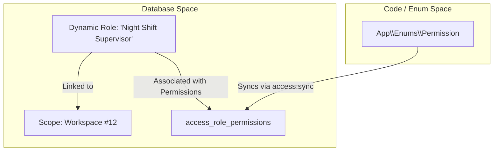

# Specification: Hybrid RBAC (Static Permissions & Dynamic Roles)

This specification outlines the architecture, database schema enhancements, and API requirements for supporting **Dynamic Roles** alongside **Static (Enum-First) Permissions** in `laravel-access`.

---

## 1. Overview & Paradigm

The hybrid approach provides a clean separation of concerns:
* **Developers** own the **Permissions** (defined strictly via PHP Enums in code).
* **Tenant Admins / Users** own the **Roles** (created and configured at runtime via the database).

This offers compile-time type-safety, static analysis compatibility, and full IDE auto-complete for developers, while giving end-users total flexibility to model their custom team structures.



---

## 2. Core Concepts

### A. Static Permissions (Enum-First)
Permissions remain defined in code using PHP Backed Enums:

```php
namespace App\Enums;

enum Permission: string
{
    case PostCreate = 'posts.create';
    case PostEdit = 'posts.edit';
    case PostDelete = 'posts.delete';
    case RolesManage = 'roles.manage'; // Meta-permission
}
```

### B. Dynamic & Scoped Roles
Roles can now be defined dynamically. While system roles (like `Platform Admin` or `Owner`) remain in the global config, user-generated roles can be created at runtime and are optionally scoped to a particular tenant model (e.g., `Workspace` or `Team`).

---

## 3. Database Schema Considerations

To support user-defined dynamic roles, we enhance the `access_roles` table:

```diff
 Schema::create('access_roles', function (Blueprint $table) {
     $table->id();
     $table->string('name');
+    $table->string('label')->nullable();
+    $table->text('description')->nullable();
     $table->boolean('is_global')->default(false);
+    $table->boolean('is_system')->default(false); // True if defined in config, false if user-created
+    $table->string('scope_type')->nullable();     // Null for system/global-access roles, Model class for tenant roles
+    $table->unsignedBigInteger('scope_id')->nullable();
     $table->timestamps();
+
+    // If scoped, name needs to be unique within that scope
+    $table->unique(['name', 'scope_type', 'scope_id'], 'access_role_scoped_unique');
 });
```

> [!NOTE]
> Setting `is_system` to `true` protects developer-defined roles from being accidentally edited or deleted by end-users in their admin panels.

---

## 4. `access:sync` Coexistence

The `access:sync` command must be updated to ignore user-created dynamic roles:

1. **Permissions Syncing**:
   * All enum cases listed in `permission_enums` are synced to `access_permissions`.
   * Stale permissions are pruned (if `--prune` is passed).

2. **Roles Syncing**:
   * Roles defined in `config('access.roles')` and `config('access.global_roles')` are synced and marked as `is_system = true`.
   * When pruning stale roles: **Only prune roles where `is_system = true`**.
   * User-defined dynamic roles (`is_system = false`) are left completely untouched.

---

## 5. API & Usage Examples

### A. Creating a Dynamic Scoped Role
Create a custom role for a specific workspace using the scoped `createRole` method. The library automatically scopes the role to the workspace model, sets `is_system => false`, and sets `is_global => false`:

```php
// Creating a dynamic scoped role
$role = $user->in($workspace)->createRole('editor-assistant', 'Editor Assistant', 'Help with editing articles');
```

### B. Syncing Permissions to a Dynamic Role
Tenant administrators can choose which system permissions to assign to this custom role:

```php
use App\Enums\Permission;

$user->in($workspace)->syncRolePermissions('editor-assistant', [
    Permission::PostCreate,
    Permission::PostEdit,
]);
```

### C. Adding & Removing Individual Permissions on a Role
If you want to add or remove a single permission from a role dynamically (rather than syncing the entire list):

```php
use App\Enums\Permission;

// Add a single permission
$user->in($workspace)->addPermissionToRole('editor-assistant', Permission::PostCreate);

// Remove a single permission
$user->in($workspace)->removePermissionFromRole('editor-assistant', Permission::PostCreate);
```

### D. Assigning and Checking Access
Because the underlying tables use the existing `access_assignments` structure, assigning a dynamic role and checking permissions remains exactly the same:

```php
// Assign the dynamic role to the user within a scope
$user->in($workspace)->assignRole('editor-assistant');

// Check permission (automatically resolves through the dynamic role relation)
if ($user->in($workspace)->can(Permission::PostCreate)) {
    // Authorized!
}
```

### E. Listing Applicable Roles
To show the list of roles in an admin dashboard, call `roles()`. This returns both system-wide roles and workspace-specific dynamic roles:

```php
// Get all roles available in the workspace scope
$roles = $user->in($workspace)->roles();
```

### F. Deleting a Dynamic Role
To delete a custom role:

```php
$user->in($workspace)->deleteRole('editor-assistant');
```


---

## 6. Security & Authorization Policies

To protect the creation and editing of dynamic roles, developers implement standard Laravel policies using a bootstrap **meta-permission** (e.g., `Permission::RolesManage`).

### Example: `RolePolicy`

```php
namespace App\Policies;

use App\Enums\Permission;
use App\Models\User;
use Maxiviper117\Access\Models\Role;

class RolePolicy
{
    /**
     * Determine whether the user can create a dynamic role in a workspace.
     */
    public function create(User $user, $workspace): bool
    {
        return $user->in($workspace)->can(Permission::RolesManage);
    }

    /**
     * Determine whether the user can update a role.
     */
    public function update(User $user, Role $role, $workspace): bool
    {
        // System roles defined by developers in config cannot be modified by users
        if ($role->is_system) {
            return false;
        }

        // Must be in the correct workspace and have the management permission
        return $role->scope_id === $workspace->getKey() 
            && $user->in($workspace)->can(Permission::RolesManage);
    }

    /**
     * Determine whether the user can delete a role.
     */
    public function delete(User $user, Role $role, $workspace): bool
    {
        if ($role->is_system) {
            return false;
        }

        return $role->scope_id === $workspace->getKey() 
            && $user->in($workspace)->can(Permission::RolesManage);
    }
}

---

## 7. Scaffolding Dynamic Role Actions

To provide developers with a lower-level, single-responsibility way to interact with dynamic roles, running `access:install` scaffolds five Action classes inside the application under the `App\Actions\Access` namespace.

These classes are completely standalone and avoid external package dependencies:

### A. `CreateRole`
Creates a dynamic or global role. Automatically converts a name to a friendly headline if `label` is omitted.
```php
use App\Actions\Access\CreateRole;

// Scoped custom role
$role = CreateRole::run('editor-assistant', 'Editor Assistant', 'Help with editing articles', $workspace);

// Global custom role
$role = CreateRole::run('support-agent', null, 'Global support role');
```

### B. `SyncRolePermissions`
Maps static permissions to a dynamic role while validating scopes and invalidating cache.
```php
use App\Actions\Access\SyncRolePermissions;
use App\Enums\Permission;

SyncRolePermissions::run($role, [
    Permission::PostCreate,
    Permission::PostEdit,
], $workspace);
```

### C. `AddPermissionToRole`
Adds a single permission dynamically to a global or scoped custom role, normalizing names and invalidating the `AccessCache`.
```php
use App\Actions\Access\AddPermissionToRole;
use App\Enums\Permission;

AddPermissionToRole::run($role, Permission::PostCreate, $workspace);
```

### D. `RemovePermissionFromRole`
Removes a single permission dynamically from a global or scoped custom role, normalizing names and invalidating the `AccessCache`.
```php
use App\Actions\Access\RemovePermissionFromRole;
use App\Enums\Permission;

RemovePermissionFromRole::run($role, Permission::PostCreate, $workspace);
```

### E. `DeleteRole`
Safely deletes dynamic custom roles while preventing system roles from being destroyed.
```php
use App\Actions\Access\DeleteRole;

DeleteRole::run($role, $workspace);
```


